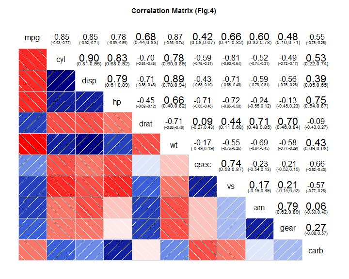

MTCARS - Regression Analysis
========================================================

#### Executive Summary
The purpose of this exercise is to look at a data set of a collection of cars,and find out a possible relationship between a set of variables and miles per gallon (MPG) (outcome). To do this I have used regression modelling technique to fit a relationship between MPG and other variables that may be influencing MPG. To achieve this I first did some exploratory analysis to see the variables that possibly have a relationship with MPG using plots. After that I started with an initial model with the variables having a definite relationship. Using backwards and forward elimination (using best function in R) I arrived at a particular "Best" model. I compared that model to my original model and also ran some diagnostic tests to make sure the model is indeed the best model. Based on that I made my conclusion and also tried to answer the below two questions:
- "Is an automatic or manual transmission better for MPG"
- "Quantifying how different is the MPG between automatic and manual transmissions?"

#### Data Transformation
We have used the mtcars data for this particular analysis.If we analyse the structure of mtcars we will see that all variables are numeric. However for our analysis we need some variables to be factor variables. Hence I converted discrete variables (cyl, vs, gear, carb, am to Automatic, Manual) to factor before starting the analysis. Code not shown to save space. Refer to git hub markdown in Appendix.


#### Exploratory Analysis
Since our objective is to find out which transmissions better for mpg we start by creating a histogram.In Appendix the Fig. 1 shows mpg for automatic vehicles and Fig. 2 shows for Manual ones. From the plots we can see that for AT (Automatic Transmission) the mpg is more centered around  15-20 and is unimodal, while that for MT(Manual Transmission) is bimodal.In the means (shown by blue lines in Fig.2) although mean of MT is higher than AT we cannot make direct conclusions as MT histogram is unimodal.There is definitely a confounding variable(s) here that we need to find which may help answer the question of which mode of transmission is better.
Next I have created a plot between different variables of mtcars and also built a correlation matrix (Fig. 4). Based on that I selected the initial set of variables having high correlation with mpg. I have selected the variables having an absolute correlation of 0.6 and above with mpg. Hence the initial set of variables I chose to build my regression model are: cyl, disp, hp, drat, wt, vs and am.Based on the above variables I now build my model.
#### Modelling
Hence base on my initial analysis above I have started with a model with the above variables as my initial set of predictors. Also to cross verify if my starting model is in fact better than a model with all variables and a model with only am I did a quick check for R square of all 3 models and found indeed my initial model was better.

```r
model1 <- lm(mpg ~ ., data = mtcars)
model2 <- lm(mpg ~ cyl + disp + hp + drat + wt + vs + am, data = mtcars)
model3 <- lm(mpg ~ am, data = mtcars)
## Adjusted R-suqre with all variables
summary(model1)$adj.r.squared
```

```
## [1] 0.779
```

```r
## Adjusted R-suqre with am variables
summary(model3)$adj.r.squared
```

```
## [1] 0.3385
```

```r
## Summary of my initial model
summary(model2)$adj.r.squared
```

```
## [1] 0.8292
```

From above we see that adjusted R square is approx. 83% for model2, which is not bad, and in fact the best of all 3 models. However when we see details, the p values for most of the variables are quite high and hence we cannot say this is the best model.
Hence in my next step I am finding the best fit model using step() function in R. step() is a very good function that runs lm multiple times to build multiple regression models and select the best variables from them using both forward selection and backward elimination methods by using extractAIC (An Information Criterion). Since I am using AIC method I won't be checking for p-values and my result will be based on final Adjusted R square.

```r
model_final <- step(model2, direction = "both", trace = 0)
summary(model_final)
```

```
## 
## Call:
## lm(formula = mpg ~ cyl + hp + wt + am, data = mtcars)
## 
## Residuals:
##    Min     1Q Median     3Q    Max 
## -3.939 -1.256 -0.401  1.125  5.051 
## 
## Coefficients:
##             Estimate Std. Error t value Pr(>|t|)    
## (Intercept)  33.7083     2.6049   12.94  7.7e-13 ***
## cyl6         -3.0313     1.4073   -2.15   0.0407 *  
## cyl8         -2.1637     2.2843   -0.95   0.3523    
## hp           -0.0321     0.0137   -2.35   0.0269 *  
## wt           -2.4968     0.8856   -2.82   0.0091 ** 
## amManual      1.8092     1.3963    1.30   0.2065    
## ---
## Signif. codes:  0 '***' 0.001 '**' 0.01 '*' 0.05 '.' 0.1 ' ' 1
## 
## Residual standard error: 2.41 on 26 degrees of freedom
## Multiple R-squared:  0.866,	Adjusted R-squared:  0.84 
## F-statistic: 33.6 on 5 and 26 DF,  p-value: 1.51e-10
```

From the above model we see that the adjusted R square value is 84%,the maximum obtained considering all combinations of variables. This means that 84% of variability in the model is explained by the variables in above model which are Cylinder, Horse Power, Weight and Transmission.
To confirm that rest of the confounding variables are indeed not significant to mpg, we do one  ANOVA test.

```
## Analysis of Variance Table
## 
## Model 1: mpg ~ cyl + disp + hp + drat + wt + vs + am
## Model 2: mpg ~ cyl + hp + wt + am
##   Res.Df RSS Df Sum of Sq    F Pr(>F)
## 1     23 143                         
## 2     26 151 -3     -8.37 0.45   0.72
```

From ANOVA test above we can see that P values is 0.7198 and is not significant and hence we accept the null hypothesis that other variables do not make a vital contribution to improve the accuracy of the model. Thus the variables we have in our final model are good contributors to overall model accuracy.
#### Residual Diagnostics
Referring to Fig.5 in Residual Section we can make the following conclusions. The residual plot shows random scatter thus confirming independence condition and no bias. 3 outliers are also clearly visible in the plot. The linearity of the points on the Quantile-Quantile plot suggests that the residuals are normally distributed. This indicates that probabilities we saw in the summary table are almost accurate.Like the first plot scale-location plot shows no discernible pattern, indicating near constant variance (except for Outliers). Cook's distance identifies 3 points which have more influence than other points and are potential outliers and should be investigated further.
We now compute some regression diagnostics of our model to find out these interesting leverage points as shown in the following section. We compute top three points in each case of influence measures.
#### Inference & Conclusion
We now conduct a t Test to confirm that means of AT and MT are significantly different and than conclude what variables contribute to this difference based on our final model above.

```
## 
## 	Welch Two Sample t-test
## 
## data:  mpg by am
## t = -3.767, df = 18.33, p-value = 0.001374
## alternative hypothesis: true difference in means is not equal to 0
## 95 percent confidence interval:
##  -11.28  -3.21
## sample estimates:
## mean in group Automatic    mean in group Manual 
##                   17.15                   24.39
```

From the above we can infer that in mtcars, the mean mileage of automatic transmission is 17.147 mpg and the manual transmission is 24.392 mpg. The 95% confidence interval of the difference in mean gas mileage is between 3.2097 and 11.2802 mpg.
Coming back to our original question, based on the model I have tried to answer them below. We cannot definitely say that manual is better than automatic but cars with Manual transmission get 1.8 times more mpg compared to cars with Automatic transmission with other variables remaining constant (adjusted for other variables).MPG also decreases 2.5 times for 1000lb increase in weight while horsepower does not have much effect on mpg.Also having less number of cylinders gives more mpg compared to higher number of cylinders.
### Appendix
 


 


 


 


